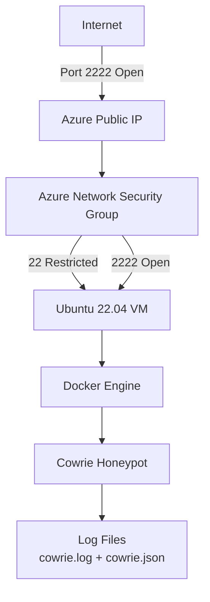
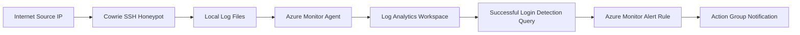

## Azure-Cowrie-Honeypot-Lab
Deploying a Cowrie SSH honeypot on Microsoft Azure to capture real-world attacker behavior, analyze telemetry, and generate threat intelligence aligned with MITRE ATT&CK.

# Overview
This project demonstrates:
- Azure VM provisioning
- Secure baseline hardening
- Cowrie SSH honeypot and deployment
- Log analysis
- Basic threat hunting
- MITRE ATT&CK mapping

# ⛏️Tools used
- Cloud Provider: Microsoft Azure
- OS: Ubuntu
- Containerization: Docker
- Honeypot: Cowrie
- Network Filtering: Azure NSG
- Log Analysis: Cowrie logs

# ☑️Architecture

# Deployment
NB: Initial deployment was performed via Azure Portal UI for rapid prototyping
</> Markdown
1. Install ubuntu vm on Azure
2. Deployed Cowrie on docker:
- To isolate honeypot environment
- Prevent host compromise

# Configuring Azure resource collection
</> Markdown
1.Configured Azure NSG:

- Opened Port 2222 for honeypot deception
- Allowed SSH (Port 22) from only one source IP
Security principle applied: Minimize attack surface while exposing controlled deception services.

2. Log Analytic Workplace Configuration:
To store security logs:
- VM telemetry
- Custom logs (cowrie.log)
- Performance metrics

The following resource was connected:
- Azure VM hosting Cowrie Honeypot
- Azure Monitor Agent installed (Linux)
- Data Collection Rule as shown later on.

Tables used:

- Syslog for linux authentication logs
- Hearbeat for VM health monitoring
- Perf for CPU & mmemory monitoring
- CowrieText_CL for Honeypot attack telemetry


3. Data Collection Endpoint:
 - To grab data from linux machine
 - Azure moonitor Agent installed
 - Connected to Log Analytics Workspace
 - Syslog enabled
 - Custom log ingestion configured (Cowrie.log)


4. Azure Data Collection Rules:
The Data Collection Rule was configured via Azure Portal to collect telemetry from the Endpoint hosting the Cowrie honeypot
Define what logs are collected:
  - From which resource
  - Where the logs are sent (Log Analytic workplace)
  - What table they land in ( CowrieText_CL)
  

##  Threat Hunting -  Parsing Cowrie "New Connection" Events
**Objective:** Extract and Structure Cowrie SSH connection telemetry from 'CowrieText_CL' to be used for hunting.
** Why it matters:** Raw text logs are hard to analyze at scale. This query converts logs into normalized fields (SrcIP) to support SOC workflows.
- Simulating from attacker machine,Logging in with privilege access(root):

### KQL Query (Log Analytics)

```kql
CowrieText_CL
| where RawData has "New connection:"
| extend 
    Message   = extract(@"\]\s+(.*)$", 1, RawData),
    Timestamp = extract(@"^(\d{4}-\d{2}-\d{2}T[^Z]+Z)", 1, RawData),
    SrcIP = extract(@"New connection: (\d+\.\d+\.\d+\.\d+):\d+", 1, RawData),
    SrcPort = extract(@"New connection: \d+\.\d+\.\d+\.\d+:(\d+)", 1, RawData),
    DstIP = extract(@"\((\d+\.\d+\.\d+\.\d+):", 1, RawData),
    DstPort = extract(@"\(\d+\.\d+\.\d+\.\d+:(\d+)", 1, RawData),
    SessionID = extract(@"\[session: ([a-f0-9]+)\]", 1, RawData)
| project-away RawData
```
#### Output fields produced:
- Timestamp - event timestamp extracted from log line
- SrcIP, SrcPort - attacker source IP/port
- DstIP, DstPort - destination (honeyport container IP/port)
- SessionID - Cowrie session identifier (key for correlation)
- Message - cleaned message text


## Threat Hunting - Detecting Cowrie "Successful SSH Login"
**Objective:**Extract and Stucture Cowrie Successfull SSH Login telemetry from 'CowrieText_CL' to be used for hunting and trigger a near real-time Azure Monitor alert 

#### KQL Query (Log Analytics)

```kql
CowrieText_CL
| where RawData has "login attempt" and RawData has "succeeded"
| extend
    EventID = "cowrie.login.success",
    Timestamp = extract(@"^(\d{4}-\d{2}-\d{2}T[^Z]+Z)", 1, RawData),
    SrcIP = extract(@"\b(\d{1,3}(\.\d{1,3}){3})\b", 1, RawData),
    Username  = extract(@"login attempt \[b'([^']+)'", 1, RawData),
    Password  = extract(@"login attempt \[b'[^']*'/b'([^']*)'", 1, RawData),
    SessionID = extract(@"\[session:\s*([a-f0-9]+)\]", 1, RawData),
    Message = extract(@"\]\s+(.*)$", 1, RawData),
    Status = iif(RawData has "succeeded", "success", "failure")
| project TimeGenerated, EventID, SrcIP, Username, SessionID, Message, Password, Status
| sort by TimeGenerated desc
```
#### Output fields produced:
- Timestamp - event timestamp extracted from log line
- SrcIP - attacker source IP
- Status - login success 
- Message - cleaned message text


### Create Azure Alert Rule
## 🚨 Successful SSH Login Alert Workflow


### Condtion
- This means an alert will be trigged if at least 1 successful login occurs:

### Action
- Added to an existing action group with notification set to email:

### Alert Details
- Severity set to critical

## SSimulating login

## Alert trigged and Action Group nofitied via email


# NB: this validates the full detection pipeline from endpoint to cloud alerting

# Threat Hunting and detections
- To simulate a real-world internet-exposed system, NSG was configured with a permissive inbound rule allowing traffic from any source to the SSH honeyport. Attackers discovering and interaction with the honeypot generates telemetry for analysis in Microsoft Sentinel:


  

7. 
8.
9. - 
- 
>
